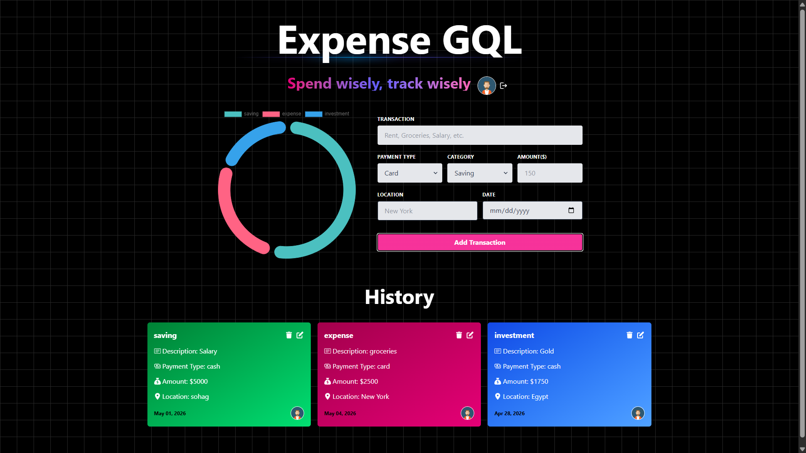
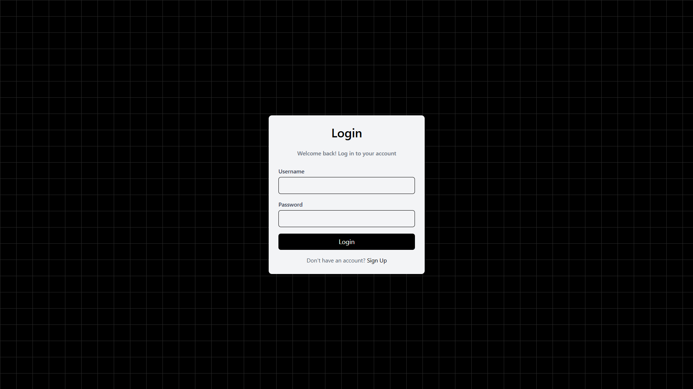
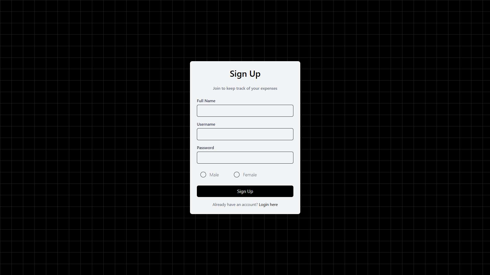

<p align="center">
  
  
  
  
</p>

<h1 align="center">💸 Expense Tracker</h1>

<p align="center">
  <strong>A modern, full-stack expense tracking application built with the MERN stack and GraphQL.</strong>
  <br />
  Track your savings, expenses, and investments with beautiful doughnut charts, <br /> category-based color coding, and a seamless user experience.
</p>

<br />


---

## ✨ Features

| Feature | Description |
|---------|-------------|
| 🔐 **Authentication** | Secure sign-up & login with Passport.js and session-based auth |
| 📊 **Doughnut Chart** | Visual breakdown of spending by category (Saving / Expense / Investment) |
| 💳 **Transaction CRUD** | Create, read, update, and delete transactions with ease |
| 🏷️ **Category System** | Color-coded cards — _green_ for savings, _pink_ for expenses, _blue_ for investments |
| 💰 **Payment Types** | Track transactions made via **card** or **cash** |
| 📍 **Location Tracking** | Attach a location to each transaction |
| 📈 **Category Statistics** | Aggregated spending stats powered by GraphQL queries |
| 🖼️ **Profile Avatars** | Gender-based auto-generated profile pictures |
| 🔔 **Toast Notifications** | Instant feedback via `react-hot-toast` |
| 📱 **Responsive Design** | Fully responsive layout with Tailwind CSS v4 |

---

## 📸 Screenshots

<p align="center">
  
  <br />
  <em>Dashboard — Doughnut chart with transaction form and category cards</em>
</p>

<br />

<p align="center">
  
  <br />
  <em>Login Page — Clean authentication with gradient accents</em>
</p>

<br />

<p align="center">
  
  <br />
  <em>Sign Up Page — User registration with gender selection</em>
</p>

---

## 🛠️ Tech Stack

### Frontend
| Technology | Purpose |
|-----------|---------|
| **React 19** | UI library with hooks & functional components |
| **Vite 8** | Lightning-fast dev server & build tool |
| **Apollo Client 4** | GraphQL state management & caching |
| **Tailwind CSS 4** | Utility-first CSS framework |
| **Chart.js + react-chartjs-2** | Interactive doughnut charts |
| **Framer Motion** | Smooth animations & transitions |
| **React Router v7** | Client-side routing with auth guards |
| **React Hot Toast** | Elegant toast notifications |
| **React Icons** | Comprehensive icon library |

### Backend
| Technology | Purpose |
|-----------|---------|
| **Node.js + Express 5** | Server runtime & HTTP framework |
| **Apollo Server 5** | GraphQL API server |
| **MongoDB + Mongoose 9** | NoSQL database & ODM |
| **Passport.js** | Authentication middleware |
| **express-session** | Session management with MongoDB store |
| **bcryptjs** | Secure password hashing |
| **GraphQL** | Flexible query language for the API |

---

## 📁 Project Structure

```
Expense-Tracker/
├── backend/
│   ├── db/                     # Database connection
│   │   └── connectDb.js
│   ├── models/                 # Mongoose schemas
│   │   ├── user.model.js       # User schema (name, username, password, avatar, gender)
│   │   └── transaction.model.js # Transaction schema (amount, category, payment, location)
│   ├── typedefs/               # GraphQL type definitions
│   │   ├── user.typedef.js     # User queries, mutations & inputs
│   │   └── transaction.typedef.js # Transaction queries, mutations & inputs
│   ├── resolvers/              # GraphQL resolvers
│   │   ├── user.resolver.js    # Auth logic (signup, login, logout)
│   │   └── transaction.resolver.js # CRUD + category statistics
│   ├── passport/               # Passport.js configuration
│   │   └── passport.config.js
│   ├── index.js                # Server entry point
│   └── package.json
│
├── frontend/
│   ├── public/                 # Static assets
│   ├── src/
│   │   ├── components/
│   │   │   ├── ui/
│   │   │   │   ├── Header.jsx          # Navigation header
│   │   │   │   └── GridBackground.jsx  # Decorative grid background
│   │   │   ├── Card.jsx                # Transaction card with category colors
│   │   │   ├── Cards.jsx               # Transaction cards container
│   │   │   ├── TransactionForm.jsx     # Add new transaction form
│   │   │   ├── InputField.jsx          # Reusable input component
│   │   │   ├── RadioButton.jsx         # Reusable radio button component
│   │   │   └── skeletons/              # Loading skeleton components
│   │   ├── pages/
│   │   │   ├── HomePage.jsx            # Dashboard with chart + transactions
│   │   │   ├── LoginPage.jsx           # User login
│   │   │   ├── SignUpPage.jsx          # User registration
│   │   │   ├── TransactionPage.jsx     # Edit transaction
│   │   │   └── NotFoundPage.jsx        # 404 page
│   │   ├── graphql/
│   │   │   ├── queries/                # GraphQL query definitions
│   │   │   └── mutations/              # GraphQL mutation definitions
│   │   ├── utils/                      # Utility functions
│   │   ├── App.jsx                     # Root component with routing
│   │   └── main.jsx                    # App entry point with Apollo Provider
│   ├── index.html
│   └── package.json
│
├── .gitignore
└── README.md
```

---

## 🚀 Getting Started

### Prerequisites

- **Node.js** ≥ 18.x
- **MongoDB** (local or [MongoDB Atlas](https://www.mongodb.com/atlas))
- **npm** or **yarn**

### 1. Clone the Repository

```bash
git clone https://github.com/your-username/expense-tracker.git
cd expense-tracker
```

### 2. Backend Setup

```bash
cd backend
npm install
```

Create a `.env` file in the `backend/` directory:

```env
MONGO_URI=mongodb://localhost:27017/expense-tracker
SESSION_SECRET=your_super_secret_key_here
```

Start the backend server:

```bash
npm run dev
```

> The GraphQL server will be running at **http://localhost:4000/graphql**

### 3. Frontend Setup

```bash
cd frontend
npm install
npm run dev
```

> The React app will be running at **http://localhost:5173**

---

## 🔗 GraphQL API

### Queries

| Query | Description |
|-------|-------------|
| `authUser` | Get the currently authenticated user |
| `user(_id: ID!)` | Get a user by ID |
| `transactions` | Get all transactions for the logged-in user |
| `transaction(transactionId: ID!)` | Get a single transaction by ID |
| `categoryStatistics` | Get aggregated spending stats by category |

### Mutations

| Mutation | Description |
|----------|-------------|
| `signUp(input: SignUpInput!)` | Register a new user |
| `login(input: SignInInput!)` | Log in an existing user |
| `logout` | Log out the current session |
| `createTransaction(input: CreateTransactionInput!)` | Add a new transaction |
| `updateTransaction(input: UpdateTransactionInput!)` | Edit an existing transaction |
| `deleteTransaction(transactionId: ID!)` | Remove a transaction |

---

## 🎨 Category Color System

Transactions are visually differentiated with gradient color coding:

| Category | Gradient | Usage |
|----------|----------|-------|
| 💚 **Saving** | `green-700 → green-400` | Money set aside for future use |
| 💗 **Expense** | `pink-800 → pink-600` | Day-to-day spending |
| 💙 **Investment** | `blue-700 → blue-400` | Money invested for growth |

---

## 🔒 Authentication Flow

```
┌──────────┐     ┌──────────────┐     ┌──────────┐
│  Client   │────▶│ Passport.js  │────▶│ MongoDB  │
│  (React)  │◀────│  + Sessions  │◀────│  Store   │
└──────────┘     └──────────────┘     └──────────┘
```

1. User signs up with **name**, **username**, **password**, and **gender**
2. Password is hashed with **bcryptjs** before storing
3. Session is created and stored in **MongoDB** via `connect-mongodb-session`
4. Auth state is checked on every route via the `authUser` GraphQL query
5. Protected routes redirect unauthenticated users to `/login`

---

## 📌 Environment Variables

| Variable | Description | Example |
|----------|-------------|---------|
| `MONGO_URI` | MongoDB connection string | `mongodb://localhost:27017/expense-tracker` |
| `SESSION_SECRET` | Secret key for session encryption | Any random secure string |

---

## 🤝 Contributing

Contributions are welcome! Feel free to open an issue or submit a pull request.

1. Fork the repository
2. Create your feature branch (`git checkout -b feature/amazing-feature`)
3. Commit your changes (`git commit -m 'Add amazing feature'`)
4. Push to the branch (`git push origin feature/amazing-feature`)
5. Open a Pull Request

---

## 📄 License

This project is open source and available under the [MIT License](LICENSE).

---

<p align="center">
  Made with ❤️ using the MERN Stack + GraphQL
</p>
